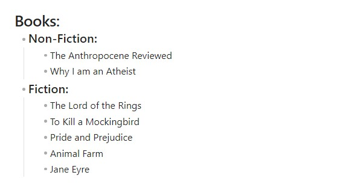

# Line Arrange – Obsidian Plugin

## Overview

Line Arrange is an [Obsidian](https://obsidian.md) plugin that lets you rearrange lines, blocks, or headings in different ways: **sorting, reversing, and shuffling**.
Sorting can be done alphabetically or by **visual width** (how wide the text looks on screen).

---

## Features

### Line Operations

Operate on a **flat selection of lines**. Hierarchy is ignored; each line is treated individually.

* **Sort lines by width** – order by rendered text width

  

* **Sort lines lexically** – order alphabetically (A → Z)

  

* **Shuffle lines** – randomize order

  

* **Reverse lines** – flip order top-to-bottom

  

---

### Block Operations

Operate on **paragraphs, lists, or sections**.
Block hierarchy (headings, indentation) is preserved.

* **Sort blocks by width** – order blocks by their widest line

  

* **Sort blocks lexically** – alphabetical order by first line of block

  

* **Shuffle blocks** – randomize block order while keeping sub-blocks grouped

  

* **Reverse blocks** – flip sibling blocks while preserving nesting

  

---

#### How Block Sorting Works

A **block** = a group of lines separated by blank lines (paragraph, list, or heading section).

When rearranging blocks:

* Headings stay at the top of their section.
* Indented or nested items remain with their parent.
* Sorting/shuffling happens within each level.
* Reversing flips sibling order but keeps children attached.

> Blocks are treated as **structural units** separated by blank lines.
> Nesting and indentation remain intact.

**Limitations**: Complex elements (horizontal rules, tables, code blocks, deeply nested structures) may not behave as expected.

---

### Heading Operations

Operate only on **top-level headings in your selection**.
The heading itself determines the order; everything beneath each heading (subheadings, paragraphs, lists) stays attached.

* **Sort headings by width** – order by rendered heading width
* **Sort headings lexically** – alphabetical order by heading text
* **Shuffle headings** – randomize heading order
* **Reverse headings** – flip heading order

> Subheadings and content remain intact under their parent heading.
> These commands only affect **the selected heading level** (shallowest).

---

## Usage

1. Select the lines or blocks you want to arrange.

  

2. Open the **Command Palette** (`Ctrl/Cmd + P`) and run a command such as:

   * `Sort lines` – arranges lines by visual width.

    

---

## List of Commands

### Lines

* `Lexisort lines` – alphabetically sorts selected lines
* `Reverse lines` – reverses line order
* `Sort lines` – sorts lines by visual width
* `Shuffle lines` – randomizes line order

### Headings

* `Lexisort headings` – alphabetically sorts top-level headings
* `Reverse headings` – reverses heading order
* `Sort headings` – sorts headings by visual width
* `Shuffle headings` – randomizes heading order

### Blocks

* `Lexisort blocks` – alphabetically sorts text blocks
* `Reverse blocks` – reverses sibling block order
* `Sort blocks` – sorts blocks by visual width
* `Shuffle blocks` – randomizes block order

---

## Installation

### From within Obsidian

1. Open **Settings → Community plugins**.
2. Search for **Line Arrange**.
3. Click **Install**, then **Enable**.

### Manual installation

1. Download the latest release from [GitHub Releases](https://github.com/chitwan27/lineArrange/releases).
2. Extract into your vault at:

  ```bash
  YourVault/.obsidian/plugins/lineArrange
  ```

3. Enable the plugin in Obsidian settings.

---

## Notes

* Supports **configurable locales** for lexical sorting (so A–Z order respects your language/region).
* Works best in **source mode** or when selections are cleanly separated.

---

## Contributing

If you find a bug or have a feature request, open an issue on [GitHub](https://github.com/chitwan27/lineArrange).
